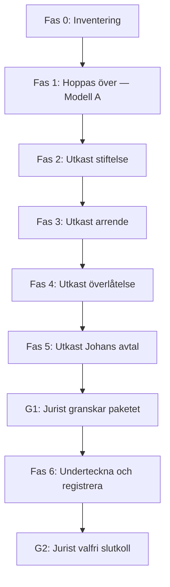

# Action plan — Sollerö Ladan (stiftelse och juridisk struktur)

**Status:** Utkast / planeringsdokument  
**Senast uppdaterad:** 2026-05-24 (Modell A — Johans val)

**Valt upplägg:** **Modell A** — en fastighet till barnen; stiftelse med **100-års arrende** på ladans mark; **ingen fastighetsbildning** hos Lantmäteriet. Bekräftat av **Johan Rabén** (L-00). Se [`01-fastighetsbildning/behov-fastighetsbildning.sv.md`](01-fastighetsbildning/behov-fastighetsbildning.sv.md).  
**Mål:** Sätta ihop alla juridiska dokument och starta en stiftelse för Sollerö Ladan, samtidigt som mark och övriga byggnader överlåts till Johans barn med livslång nyttjanderätt/hyresrätt för Johan.

**Viktigt:** Detta är **inte juridisk rådgivning**. Alla dokument i denna mapp är **utkast och arbetsmaterial** tills de granskats och godkänts vid **granskningspass** (jurist) och **myndighetsregistrering** där det krävs.

**Arbetssätt:** Ni tar fram **alla utkast själva** i detta repo. En jurist används **inte** för att skriva från scratch utan för att **dubbelkolla** färdiga paket innan undertecknande — se [`arbetssatt-sjalv-beta-granskning.sv.md`](arbetssatt-sjalv-beta-granskning.sv.md) och [`granskningspunkter-jurist.sv.md`](granskningspunkter-jurist.sv.md).

---

## 1. Sammanfattning av målbilden

| Del | Nuvarande läge | Mål |
|-----|----------------|---------|
| **Mark + privata hus** | Ägs av Johan Rabén | Överlåts till barnen (gåva eller köp — se avsnitt 4) |
| **Johans rätt att bo/förvalta** | Implicit som ägare | **Skriftligt, juridiskt bindande** avtal: Johan är **hyresvärd** (eller motsvarande förvaltningsrätt enligt valt avtal) **livet ut** över hela tomten **utom** Sollerö Ladan |
| **Sollerö Ladan** | Byggnad på Johans tomt | **Egen stiftelse** med styrelse; ladan (och ev. avgränsad mark) tillhör stiftelsen |
| **Ladans mark** | Del av samma fastighet som övrigt | **100-årigt arrende** (eller tomträtt — se avsnitt 5) från barnens fastighet till stiftelsen |
| **Säkerhet mot försäljning** | Ingen | Arrende + stiftelseförordnande + ev. servitut och inskränkningar i överlåtelse gör det **praktiskt och rättsligt svårt** att avveckla ladans syfte |

**Huvudägare / initiativtagare:** Johan Rabén.

---

## 2. Öppna frågor (fyll i innan utkast färdigställs)

Besvara gärna dessa i en separat fil [`frågor-och-svar.sv.md`](frågor-och-svar.sv.md) eller direkt i detta avsnitt.

### 2.1 Fastighet och byggnader

- [ ] **Fastighetsbeteckning** (t.ex. Sollerö X:Y) och **kommun**?
- [ ] Hur många **byggnader** finns på tomten (privata hus, lada, uthus, garage)?
- [ ] Är **lada och bostadshus på samma lagfarda fastighet** idag, eller redan uppdelat?
- [ ] Finns **bygglov/färdigställande** för ladan? Klassificering (komplementbyggnad, samlingslokal, etc.)?
- [ ] **Areal** ungefärlig för hela tomten respektive yta ladan + nödvändig mark runt om?
- [ ] Finns **inteckningar, servitut, arrenden eller andra belastningar** registrerade?

### 2.2 Barnen och överlåtelse

- [ ] **Antal barn** och **namn** (för avtal — personnummer hanteras utanför repo om möjligt)?
- [ ] **Ägarandel:** lika delar eller annat fördelningsförslag?
- [ ] Ska de äga **gemensamt** (samäganderätt) eller **individuellt** (fastighetsbildning till flera lotter)?
- [ ] **Ariel (minderårig):** 1/3 vid 18 — [`tillagg-gava-ariel-vid-18.sv.md`](04-overlatelse/tillagg-gava-ariel-vid-18.sv.md). **Intressenter:** [`intressenter.sv.md`](intressenter.sv.md)

### 2.3 Johan — livslång rätt

- [ ] Johans avsikt är **hyresvärd** livet ut — ska det formaliseras som **förvaltnings-/nyttjanderättsavtal**, **hyresavtal** (ovanligt när han inte äger), **ususfrukt** vid gåva, eller annat? *(Fastställ i familjemöte; jurist granskar vid G1.)*
- [ ] Omfattar rätten **hela bostadshus**, **del av hus**, eller **hela fastigheten minus lada**?
- [ ] Vem betalar **drift, underhåll, försäkring, fastighetsskatt** under Johans livstid respektive efter?
- [ ] Vad händer **vid Johans frånfälle** — upphör avtalet automatiskt, eller ska vissa rättigheter övergå?

### 2.4 Stiftelsen

- [ ] **Stiftelsens syfte** i klartext (kultur, samling, gemenskap, ideell verksamhet — var så konkret som möjligt)?
- [ ] **Föreslagen initial styrelse** (minst 3 personer enligt praxis; vem ordförande, kassör, ledamot)?
- [ ] **Stiftare:** endast Johan, eller flera?
- [ ] **Kapital/grunddonation** till stiftelsen vid bildande (belopp, fast egendom = ladan)?
- [ ] Ska stiftelsen **hyra ut** ladan, ha **öppna evenemang**, eller endast **förvalta** byggnaden?
- [ ] **Namn:** officiellt *Sollerö Ladan* eller annat registreringsnamn?

### 2.5 Ekonomi och skatt

- [ ] Uppskattat **taxeringsvärde / marknadsvärde** fastighet och lada?
- [ ] Budget för **granskning jurist** (fast pris per pass), **lantmätare**, **stämpelskatt**, **lagfart**, **stiftelseregistrering**?
- [ ] Behövs **värdering** inför gåva (Skatteverkets regler om gåva av fast egendom)?

### 2.6 Tidplan

- [ ] Önskat **datum** för (a) stiftelse registrerad, (b) fastighetsöverlåtelse lagfaren, (c) arrende undertecknat?
- [ ] Finns **akuta skäl** (t.ex. hälsa, försäljningshot)?

---

## 3. Rekommenderad ordning (faser)

Ordningen är avgörande. **Gör inte gåva/lagfart före** fastighetsbildning och avtal är klara — annars kan barnen sitter med en fastighet där ladan fortfarande är oklar, eller Johan förlorar förhandlingsutrymme.

### Fas 0 — Inventering och välj upplägg (vecka 1–4)

| Steg | Aktivitet | Ansvar | Leverans |
|------|-----------|--------|----------|
| 0.1 | Samla **lagfartsbevis**, **taxeringsuppgifter**, **bygglov**, **försäkringsbrev** | Johan / kollega | Mapp (fysisk + digital) |
| 0.2 | Läs **stiftelse + fastighet** (officiella källor i [`arbetssatt-sjalv-beta-granskning.sv.md`](arbetssatt-sjalv-beta-granskning.sv.md)) | Kollega | Anteckningar |
| 0.3 | ~~Välj modell A eller B~~ → **Modell A** (Johan) | Johan | [`behov-fastighetsbildning.sv.md`](01-fastighetsbildning/behov-fastighetsbildning.sv.md) |
| 0.4 | Fyll i [`frågor-och-svar.sv.md`](frågor-och-svar.sv.md) | Alla parter | Pågår |
| 0.5 | ~~Lantmäteriet?~~ → **Nej** (Modell A) | — | Klart |
| 0.6 | **(Valfritt) G0** — jurist kollar Modell A-upplägg | Johan | Ej påbörjad |

**Exit-kriterium:** Upplägg valt; checklista underlag klar; alla öppna frågor i avsnitt 2 besvarade eller medvetet parkerade.

---

### Fas 1 — Fastighetsbildning *(hoppas över — Modell A)*

**Status:** **Ej aktuell.** Johan har valt **Modell A**: en gemensam fastighet till barnen; stiftelsen får **inskrivet 100-års arrende** på ladans mark. Ladabyggnaden regleras via stiftelse + avtal — **ingen** ansökan om fastighetsbildning hos Lantmäteriet.

Checklistor i [`01-fastighetsbildning/`](01-fastighetsbildning/) används för **underlag** (kartor, gränser i bilaga), inte för fastighetsbildning.

Modell B (ej valt) — referens om upplägg ändras senare

Om lada och bostäder skulle delas i **två fastigheter**:

- **Fastighet A:** bostad + tomt → barnen
- **Fastighet B:** lada + mark → stiftelsen

Kräver Lantmäteriet (veckor/månader). Se [handbok](https://www.lantmateriet.se/sv/fastigheter-och-mark/fastighetsbildning/).

---

### Fas 2 — Utkast: stiftelse (vecka 4–10)

En **stiftelse** bildas genom **stiftelseförordnande** (skriftligt, undertecknat av stiftare). Stiftelsen blir **juridisk person** först när den **registrerats** hos Länsstyrelsen — det sker i **fas 6**, efter **G1**.

| Steg | Aktivitet | Ansvar |
|------|-----------|--------|
| 2.1 | Fyll i utkast **stiftelseförordnande** | Kollega → [`02-stiftelse/stiftelseforordnande.sv.md`](02-stiftelse/stiftelseforordnande.sv.md) |
| 2.2 | Fyll i **stadgar** om separata från förordnande | Kollega |
| 2.3 | Förbered **konstituerande möte** (protokollmall) | Styrelseutkast |
| 2.4 | *(Fas 6)* Registrering Länsstyrelsen | Styrelsen |
| 2.5 | *(Fas 6)* Skatteverket, bankkonto | Styrelsen |

**Dokument:** [`02-stiftelse/`](02-stiftelse/)

**Exit-kriterium (fas 2):** Färdiga utkast utan `[...]`; redo för G1.

---

### Fas 3 — Utkast: 100-års arrende (ladan på barnens mark)

För att ladan ska stå **säkert** på tomten utan att barnen kan säga upp eller sälja bort syftet:

| Steg | Aktivitet | Notering |
|------|-----------|----------|
| 3.1 | Upprätta **arrendeavtal 100 år** mellan **arrendator** (stiftelsen) och **arrendgivare** (barnen / deras fastighet) | Långt arrende ger stark nyttjanderätt |
| 3.2 | **Arrendeavgift** — symbolisk eller marknadsmässig? | Påverkar skatt |
| 3.3 | **Inskrivning** av arrende i fastighetsregistret om möjligt | Ger skydd mot tredje man |
| 3.4 | Ev. **servitut** (väg, vatten, el) till ladan | Separata handlingar |

**Alternativ till arrende:** **Tomträtt** — starkare men mer formkrav; dokumentera val i [`granskningspunkter-jurist.sv.md`](granskningspunkter-jurist.sv.md).

**Dokument:** [`03-arrende/`](03-arrende/)

**Exit-kriterium (fas 3):** Färdigt utkast arrende (+ ev. servitut); redo för G1.

---

### Fas 4 — Utkast: överlåtelse till barnen

| Steg | Aktivitet | Ansvar |
|------|-----------|--------|
| 4.1 | Fyll i **gåvobrev** eller **köpebrev** | Kollega → [`04-overlatelse/`](04-overlatelse/) |
| 4.2 | Tydligt **undantag** för Sollerö Ladan / stiftelse / arrende i samma handling | Kollega |
| 4.3 | *(Fas 6)* **Lagfartsansökan**, stämpelskatt / gåvoskatt | Barnen |

**Dokument:** [`04-overlatelse/`](04-overlatelse/)

**Exit-kriterium (fas 4):** Färdigt utkast gåvobrev; redo för G1.

---

### Fas 5 — Utkast: Johans livslånga rätt

| Steg | Aktivitet |
|------|-----------|
| 5.1 | Fyll i avtal enligt familjens val (hyresvärd / nyttjanderätt / ususfrukt) — se [`05-johan-livslang-ratt/avtal-johan-livslang.sv.md`](05-johan-livslang-ratt/avtal-johan-livslang.sv.md) |
| 5.2 | Bilaga: **avgränsning** — hela tomten **utom** Sollerö Ladan |
| 5.3 | Underhåll, försäkring, drift, vad som händer vid frånfälle |
| 5.4 | Familjemöte: alla barn godkänner utkast skriftligt |

**Dokument:** [`05-johan-livslang-ratt/`](05-johan-livslang-ratt/)

**Exit-kriterium (fas 5):** Färdigt utkast + bilaga; redo för G1.

---

### Granskningspass G1 — innan något undertecknas

| Steg | Aktivitet |
|------|-----------|
| G1.1 | Samla **alla utkast** + ifylld [`granskningspunkter-jurist.sv.md`](granskningspunkter-jurist.sv.md) |
| G1.2 | Jurist granskar (fast pris / begränsad tid) |
| G1.3 | Justera markdown-utkast enligt kommentarer |
| G1.4 | Intern sign-off (Johan + barn) på **slutversion** |

**Exit-kriterium:** Juristens “klar för undertecknande” (eller dokumenterad lista ändringar ni accepterat).

---

### Fas 6 — Underteckna, registrera, arkiv (efter G1)

**Ordning vid undertecknande** (jurist bekräftar vid G1 — typisk ordning):

1. Stiftelseförordnande (stiftare)  
2. Konstituerande styrelsemöte → ansökan **stiftelseregistrering**  
3. Arrende (stiftelse + fastighetsägare) → **inskrivning**  
4. Gåvobrev + Johans avtal (samma dag om möjligt)  
5. **Lagfart**  

| Steg | Aktivitet |
|------|-----------|
| 6.1 | **Underteckna** alla handlingar (original + kopior) |
| 6.2 | Länsstyrelsen — **registrera stiftelse** |
| 6.3 | Lantmäteriet — **lagfart**, ev. arrende inskrivet |
| 6.4 | Skatteverket — deklaration gåva/skatt enligt instruktion |
| 6.5 | Försäkringar, bank, fastighetsregister kontrollerat |
| 6.6 | **(Valfritt) G2** — jurist ser signerade kopior |
| 6.7 | Arkiv i repo + [`06-arkiv-och-protokoll/register-handlingar.sv.md`](06-arkiv-och-protokoll/register-handlingar.sv.md) |

**Dokument:** [`06-arkiv-och-protokoll/`](06-arkiv-och-protokoll/)

---

## 4. Juridiska byggstenar (kort förklaring)

### Gåva vs köp till barn

- **Gåva** är vanligt inom familjen men kan utlösa **gåvoskatt** och kräver tydligt **gåvobrev**.
- **Köp till underpris** behandlas ibland som gåva i skattehänseende.
- Läs **Skatteverkets** regler; vid G1 kan jurist flagga risk; vid stora värden ev. förhandsbesked.

### Stiftelse vs ideell förening

Ni har valt **stiftelse** — passande när syftet ska vara **varaktigt** och **svårare att avveckla** än en förening. Stiftelsen **saknar medlemmar**; styrelsen förvaltar enligt **stiftelseförordnandet**.

### Varför 100-års arrende

- Ger stiftelsen **långsiktig rätt** att använda marken.
- **Arrendgivaren** (barnen) kan inte enkelt avbryta utan grund enligt **jordabalken**.
- Kombination med **inskriven** rättighet och **stiftelseändamål** gör försäljning av “tomten med lada” i praktiken **komplicerad** för köpare (långt arrende följer fastigheten).

*Fullständig “omöjlig att sälja”-garanti finns inte — målet är **maximal juridisk säkerhet** inom svensk rätt.*

### Johans livslånga rätt

Familjens utgångspunkt: Johan ska vara **hyresvärd** livet ut över tomten utom ladan. Det kan kräva **särskild formulering** när ägandet ligger hos barnen — jämför alternativ och välj **en** linje innan G1:

| Instrument | Passar om… | Obs |
|----------|------------|-----|
| **Avtal om förvaltning / nyttjanderätt** | Johan ska **styra och nyttja** som idag | Ofta mest flexibelt; kräver tydlig bilaga |
| **Hyresavtal** (Johan hyresgäst) | Fokus är **boenderätt**, inte uthyrning | Vanligast när ägare = barn; **inte** samma som “hyresvärd” i dagligt tal |
| **Ususfrukt** vid gåva | Johan ger bort men behåller **nyttjanderätt** enligt lag | Skatteeffekter — flagga vid G1 |

---

## 5. Risker och mitigering

| Risk | Konsekvens | Mitigering |
|------|------------|------------|
| Överlåtelse före arrende/stiftelse | Barn äger allt inkl. lada | Följ fasordningen |
| Barn säljer fastigheten | Köpare tar över med arrende — men kan vilja utmana | Inskrivet arrende + lång löptid |
| Oenighet mellan barn | Blockering av beslut | Tydliga avtal; ev. majoritetsregler i samäganderätt |
| Skatteöverraskning | Extra kostnad | Värdering och Skatteverket i förväg |
| Stiftelse registreras inte korrekt | Ingen juridisk person | Följ Länsstyrelsens checklista; G1 innan registrering |
| Självgjorda utkast med fel formulering | Ogiltig eller svag handling | G1 obligatorisk; jämför med officiella mallar |
| Johan avlider — otydligt avtal | Tvist om boende | Tydligt avtal om upphörande / ingen automatisk förlängning till arvingar |

---

## 6. Dokumentindex (markdown-utkast i detta repo)

Alla filer är **mallar** ni fyller i själva; status **G1** när redo för jurist. Se respektive mapp.

| # | Dokument | Mapp | Status |
|---|----------|------|--------|
| 1 | Inventering & checklista fastighetsunderlag | [`01-fastighetsbildning/checklista-underlag.sv.md`](01-fastighetsbildning/checklista-underlag.sv.md) | Mall |
| 2 | Sammanfattning till lantmätare (behov av bildning) | [`01-fastighetsbildning/behov-fastighetsbildning.sv.md`](01-fastighetsbildning/behov-fastighetsbildning.sv.md) | Mall |
| 3 | **Stiftelseförordnande** — Sollerö Ladan | [`02-stiftelse/stiftelseforordnande.sv.md`](02-stiftelse/stiftelseforordnande.sv.md) | Utkast |
| 4 | **Stadgar** (om separata från förordnande) | [`02-stiftelse/stadgar.sv.md`](02-stiftelse/stadgar.sv.md) | Utkast |
| 5 | Protokoll konstituerande styrelsemöte | [`02-stiftelse/protokoll-konstituerande-mote.sv.md`](02-stiftelse/protokoll-konstituerande-mote.sv.md) | Mall |
| 6 | **Arrendeavtal 100 år** (stiftelse ↔ fastighetsägare) | [`03-arrende/arrendeavtal-100-ar.sv.md`](03-arrende/arrendeavtal-100-ar.sv.md) | Utkast |
| 7 | Servitut avtal (väg, ledningar) — om behövs | [`03-arrende/servitut-utkast.sv.md`](03-arrende/servitut-utkast.sv.md) | Mall |
| 8 | **Gåvobrev** fast egendom (barnen) | [`04-overlatelse/gavobrev-fastighet.sv.md`](04-overlatelse/gavobrev-fastighet.sv.md) | Utkast |
| 8b | **Tillägg** — gåva Ariel vid 18 | [`04-overlatelse/tillagg-gava-ariel-vid-18.sv.md`](04-overlatelse/tillagg-gava-ariel-vid-18.sv.md) | Utkast |
| 9 | Köpebrev (alternativ till gåva) | [`04-overlatelse/kopebrev-fastighet.sv.md`](04-overlatelse/kopebrev-fastighet.sv.md) | Mall |
| 10 | **Avtal livslång rätt** — Johan | [`05-johan-livslang-ratt/avtal-johan-livslang.sv.md`](05-johan-livslang-ratt/avtal-johan-livslang.sv.md) | Utkast |
| — | Arbetssätt själv + granskning | [`arbetssatt-sjalv-beta-granskning.sv.md`](arbetssatt-sjalv-beta-granskning.sv.md) | Referens |
| — | Checklista till jurist | [`granskningspunkter-jurist.sv.md`](granskningspunkter-jurist.sv.md) | Mall |
| 11 | Bilaga: avgränsning Sollerö Ladan (karta/ beskrivning) | [`05-johan-livslang-ratt/bilaga-avgransning-ladan.sv.md`](05-johan-livslang-ratt/bilaga-avgransning-ladan.sv.md) | Mall |
| 12 | Register över handlingar & signaturer | [`06-arkiv-och-protokoll/register-handlingar.sv.md`](06-arkiv-och-protokoll/register-handlingar.sv.md) | Mall |
| 13 | Frågor och svar (levande dokument) | [`frågor-och-svar.sv.md`](frågor-och-svar.sv.md) | Pågående |

---

## 7. Kontakter och myndigheter ( att fylla i )

| Roll | Namn | Kontakt |
|------|------|---------|
| Jurist (endast granskning G0–G2) | | |
| Lantmätare | | |
| Styrelseordförande (stiftelse) | | |
| Fastighetsägare (barn) | | |
| Länsstyrelsen Dalarnas län (stiftelseregister) | | [länsstyrelsen.se](https://www.lansstyrelsen.se/dalarna) |
| Lantmäteriet | | [lantmateriet.se](https://www.lantmateriet.se) |
| Skatteverket | | [skatteverket.se](https://www.skatteverket.se) |

---

## 8. Nästa steg (omedelbart)

1. **Fyll i** [`frågor-och-svar.sv.md`](frågor-och-svar.sv.md) tillsammans med Johan och barnen.
2. **Samla** lagfartsbevis och fastighetsbeteckning → [`01-fastighetsbildning/checklista-underlag.sv.md`](01-fastighetsbildning/checklista-underlag.sv.md).
3. **Modell A** bekräftad — hoppa **fas 1** (fastighetsbildning); fyll i utkast **02 → 03 → 04 → 05**
4. **Först därefter** — boka jurist för **G1** (hela paketet)

## 9. Relaterade filer i repot

- [`README.md`](README.md) — översikt mappen `ladan-legal`
- [`../local-exchange-juridik.sv.md`](../local-exchange-juridik.sv.md) — annat juridiskt underlag (ej kopplat till ladan, men samma disclaimer-stil)
