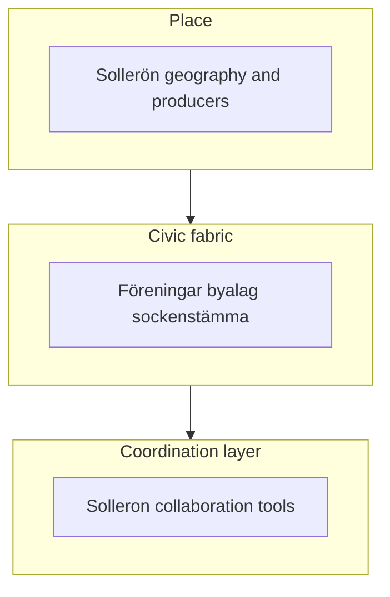

# Solleron — vision and manifest (detail)

This document is the long-form foundation for **why** the Solleron initiative exists and **how** it relates to Sollerön as a place and to existing civic life. It is meant to align residents and stakeholders around shared direction, values, and long-term local priorities. A short summary lives in [manifest.md](manifest.md).

**Naming:** The global initiative often discussed next to “Ubuntu”-style contribution economies is branded [**One Small Town (OST)**](https://www.onesmalltown.org/landing_page.php). This text uses that name.

---

## 1. Sollerön today — background and facts

### Geography and landscape

Sollerö parish (*Sollerö socken*) in Mora municipality covers the island of **Sollerön** in Lake Siljan plus forested mainland west of the lake — about **500 km²** in total. The **island** is roughly **8 km by 4 km**, with a highest point about **204 m** above sea level (~43 m above mean lake level). A fault escarpment runs north–south; east of it, settlements sit on a central ridge amid farmland; to the west the land is lower, with more forest and marsh. The island is connected to the mainland by **two bridges** (including via the small island Lerön). Siljan’s origin in a meteorite impact shapes the region’s identity and geology.

Sources: [Sollerö socken — general description](https://www.solleron.se/en/allman-beskrivning/) (EN), [Sollerö socken — allmän beskrivning](https://www.solleron.se/allman-beskrivning/) (SV if preferred).

### Population and demography

The parish overview states approximately **1,700 residents** in the parish, of whom about **1,200 live on the island**; the remainder live on the mainland in Gesunda and Ryssa and in sparsely populated areas. Population has been comparatively **stable** for several decades after an earlier decline from roughly 2,000 around the turn of the twentieth century to a low in the early 1970s near 1,500; net migration is described as positive, with births and age structure supporting cautious optimism for modest growth.

For **publication-grade** headcounts, land-area splits, and formal locality definitions, use **Statistics Sweden (SCB)** and current register data — aggregated web copy can lag or round.

### Distance and ties to Mora

Sollerön is described as **largely a commuter area** toward **Mora** and more distant workplaces, with good **bus links**. Road distance from the island to Mora centre is on the order of **tens of kilometres, not hundreds** (roughly **15 km** by road — verify on a map for exact routing). The parish’s **English** overview currently states that the distance from Sollerö church to the centre of Mora is “about **150 km**”; that figure is **inconsistent** with commuting patterns and likely a **typographical error** on the site. Treat map- or GIS-derived distance as authoritative for external documents.

### Agriculture, land use, and land-based enterprise

Historically the area had **small-scale farming**, strong **pastoral** traditions, and forestry. Today there are **no dairy farms** left in the parish; **meat production**, **sheep** (including one larger flock), and **small-scale** animals (goats, poultry, rabbits, etc.) remain. **Horses** have increased — both for keeping land open and for **commercial** breeding, training, riding, and trotting. **Horticulture** includes large-scale **strawberries and raspberries**; home gardens are common. **Fruit growing** has a long history; a **small cider** operation uses fruit from the long **apple avenue**.

Secondary land-use figures (e.g. shares of forest vs agriculture at island scale) appear on independent island databases; use them as **approximate** cross-checks only.

### Other businesses and infrastructure

There are **no large industries**; **small businesses** span tourism, crafts, construction, services, retail, design, and personal care. **Construction** remains important; **timber** and **church boat** building are living traditions. **Tourism** is increasingly significant (e.g. Tomteland on Gesundaberget); ski infrastructure has faced closure with ongoing reopening efforts. Holiday villages, camping, golf, and **consulting** in newer sectors appear in the parish portrait.

A **wind farm** on mainland parish ground (Säliträdberget and Skuruberget, eight turbines, operational from 2008) channels **wind/district funds** to local associations — a concrete example of **shared benefit** from infrastructure.

### Non-profit communities and civic structure

Community life is described as involving roughly **65 associations** — sports (with sections), choirs, hembygd, golf, weaving, recycling markets, community forest, fisheries, and more.

**Village level:** All villages except the most central (including the church village) have **village associations** (*byalag*) that maintain **village cottages**, **bathing areas**, **docks**, **maypoles**, and **festivals**. **Mountain pasture associations** (*fjällföreningar*) manage ponds and pastures in some areas.

**Sollerö Sockenförening** (formed 1994) is an **ideell förening** with a broad remit: stimulate and coordinate development, handle **external contact** with municipality and county, and run projects in cooperation with associations and businesses. Its governance is unusual and important for this manifest:

- **Membership** is open broadly (“everyone” can join) **without membership fees** — deliberately distinct from the parish’s many other associations.
- **Sockenstämma** is the **highest decision-making body**; the board is **sockenrådet**.
- Work is organized in **arbetsgrupper** (about **nine** at present; **twenty** in the early years after founding), covering diverse tasks from infrastructure to renewal projects.

Examples of collective outcomes attributed to this fabric include **bridges**, **apple avenue renewal**, **steamboat jetty rebuilding**, **Sollerömacken** (petrol/service), **Sockenhus** (parish house), and cooperation around **wind revenue** distribution.

Sources: [Organisation — Sollerö socken](https://www.solleron.se/organisation/), [Arbetsgrupper](https://www.solleron.se/sockenforeningen/arbetsgrupper/), [Sollerö Sockenförening](https://www.solleron.se/verksamhet/sollero-sockenforening/). Illustrative (non-exhaustive) list of island associations: [Föreningar, Sollerön — Sollerö hembygdsförening](https://www.sollero-hembygd.se/artikelkategori/foreningar-solleron/).

---

## 2. Is Sollerön a good place for a stronger local, community-driven economy?

### Strengths

- **Bounded geography and identity** make “local” meaningful and legible.
- **Existing producers and services** — food, crafts, construction, tourism — offer a base for **local exchange** and repeat relationships.
- **Deep civic habit**: village associations, many special-interest associations, and the **sockenförening** model show **capacity for collective action**, consultation, and shared assets — a rare social infrastructure.
- **Physical connectivity** (bridges, buses) links the island to **Mora and Siljan** without isolating it — useful for supply, services, and visitors rather than cutting the place off.

### Limits of “self-contained”

Sollerön cannot become a closed system in any literal sense. **Healthcare, schools, law, banking, telecoms, and supply chains** are national and regional. “Self-contained” is better read as **higher local circulation**, **stronger discovery of local supply**, and **resilience** — more value and trust retained **in the mesh of people and associations** — not autarky.

### Link to the Solleron community initiative

The Solleron initiative should amplify patterns that already exist (associations, volunteer labour, local trade, shared stewardship) by improving coordination, visibility of local capacity, and practical collaboration. Any future tools or projects should support the socken and föreningsliv, not replace or compete with their legitimacy.

---

## 3. Learning from other models (inspiration, not blueprint)

### 3.1 One Small Town (OST)

From [the OST landing materials](https://www.onesmalltown.org/landing_page.php), useful **patterns** include: **voluntary** participation; emphasis on **cooperation** over extractive competition; **community-level** economic imagination; and a practical framing for membership, projects, and distribution of shared benefits.

**Caveat:** OST operates at **global membership scale** with a different legal and cultural context. A Swedish parish initiative should borrow **principles and seriousness about governance**, not import mechanics wholesale.

### 3.2 “Teal” organisations — *Reinventing Organizations*

Frederic Laloux’s [*Reinventing Organizations*](https://www.reinventingorganizations.com/) describes organisations that behave more like **living systems**: **distributed authority**, **evolutionary purpose**, and **wholeness** — with practices that can replace rigid hierarchy in favour of **trust** and **peer coordination**.

For Solleron, Teal vocabulary is helpful when thinking about how local actors can co-own priorities, responsibilities, and decisions — without imposing a corporate “transformation programme” on the parish. Sollerön **already** exhibits **distributed initiative** (arbetsgrupper, föreningar) around **shared place**; future coordination should align with that culture.

### 3.3 Det nordiska sättet — Bo Andersson

Bo Andersson’s essay *Det nordiska sättet* ([docs/BRAAB e-bok.pdf](BRAAB%20e-bok.pdf)) describes a Nordic habit of **future-oriented deliberation**: **samråd**, **negotiation**, **problem-solving**, and **conflict resolution** to reach agreement — producing **trust**, **legitimacy**, and **broad acceptance** of decisions. The text links “Nordic models” (labour market, welfare, **folkrörelse** / association life, municipal autonomy, corporate governance codes) to **underlying cultural practices** rather than only to policy blueprints.

For this initiative, the booklet’s chapter headings work as a **governance checklist**: *seder och bruk*; *chefskap och ledarskap*; *ägar- och medlemsansvar*; *moral och etik*; *samråd och beslut*; *konsten att överväga*; *förhandlingar*; *procedurrättvisa*; *om konflikter*. Any coordination model should strengthen procedural fairness and transparency, not shortcut the slow legitimacy that Nordic association life depends on.

### 3.4 NewEarthX — assessed; not a fit for Sollerön (for now)

The [NewEarthX](https://newearthx.com) offering was reviewed as a possible external reference. **Conclusion: it is not a good fit for the Sollerön / Solleron project at this stage**, and we do **not** treat it as a blueprint, vendor, or partnership path.

**Why:** NewEarthX is positioned around **institutional-grade real-asset representation**, **SPV-style vehicles**, **token/blockchain** infrastructure, and **accredited-participant** framing — a different problem space than a Swedish parish initiative built on **open civic dialogue**, **existing föreningar and sockenstämma**, and **everyday local coordination**. Independent due-diligence notes (transparency of operator identity, regulatory posture) reinforce caution; a factual summary of how the site presents itself is in [newearthx-sammanfattning.sv.md](newearthx-sammanfattning.sv.md).

**What we still keep without NewEarthX:** long-term **stewardship**, **governance-before-scale**, **phased delivery**, and **traceable decisions** are already expressed in this manifest through **Nordic association practice** (§3.3), **Teal-style distributed initiative** (§3.2), and the **draft principles** (§4). Those ideas do **not** depend on adopting NewEarthX mechanics or narrative.

---

## 4. Implications for the Solleron community vision

### Draft principles

1. **Legitimacy through samråd** — major rule changes should be understandable and discussable in the parish’s normal civic channels, not only inside an app.
2. **Transparency** — priorities, responsibilities, and decision processes should be explicit and understandable.
3. **Complement, don’t capture** — work **with** Sockenförening, byalag, and existing traders; avoid positioning the platform as the “new centre” of community life.
4. **Law and prudence first** — social and organisational experiments should stay within Swedish and EU legal frameworks.
5. **Stewardship discipline** — treat land, infrastructure, and shared institutions as long-term trust assets.
6. **Practical progress** — start small, learn from real participation, and adapt with humility.
7. **Success beyond volume** — stronger relationships, local wellbeing, and perceived fairness matter more than activity counts.
8. **Conflict awareness** — disputes and exclusion touch procedural justice; conflict handling should be clear and trusted.
9. **Place and purpose** — actions should serve Siljan–Sollerön’s real social and ecological context, not imported templates.

### Open questions

- **Partnership model**: explicit role (if any) of **Sollerö Sockenförening** and other local actors.
- **Inclusion**: who gets voice early, and how new participants are welcomed.
- **Priorities**: which domains to start with (food, care, mobility, skills, youth, elders, preparedness).
- **Governance maturity**: which controls, reporting routines, and accountability structures are required at each growth stage.
- **Evaluation**: qualitative and quantitative measures agreed with local stakeholders.

---

## 5. References

Accessed **2026-05-01** unless noted.

| Resource | URL / path |
|----------|------------|
| Sollerö socken — general description (EN) | https://www.solleron.se/en/allman-beskrivning/ |
| Sollerö socken — organisation | https://www.solleron.se/organisation/ |
| Arbetsgrupper — Sollerö sockenförening | https://www.solleron.se/sockenforeningen/arbetsgrupper/ |
| Sollerö Sockenförening | https://www.solleron.se/verksamhet/sollero-sockenforening/ |
| Föreningar, Sollerön (hembygd, illustrative) | https://www.sollero-hembygd.se/artikelkategori/foreningar-solleron/ |
| One Small Town (OST) | https://www.onesmalltown.org/landing_page.php |
| Reinventing Organizations (Teal / Laloux) | https://www.reinventingorganizations.com/ |
| NewEarthX | https://newearthx.com |
| Bo Andersson — *Det nordiska sättet* (local PDF) | [BRAAB e-bok.pdf](BRAAB%20e-bok.pdf) |
| Island land-use cross-check (approximate) | https://www.islandseurope.com/description.php?island=solleron |

**Demography:** for official statistics, use **SCB** (e.g. register-based population by small area or locality definitions relevant to your claim).
