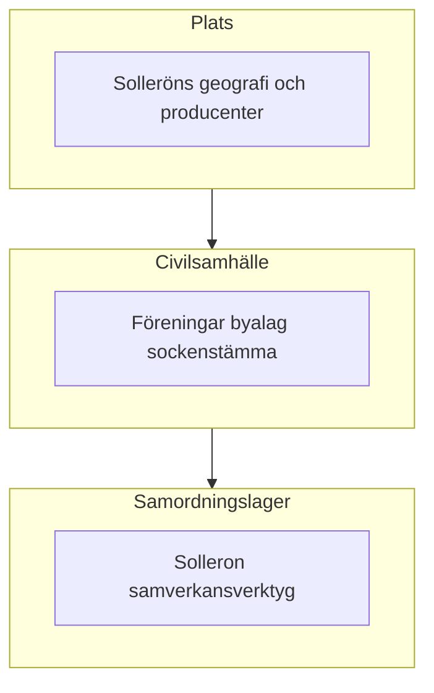

# Solleron — vision och manifest (detalj)

Detta dokument är den längre grunden för **varför** Solleron-initiativet finns och **hur** det förhåller sig till Sollerön som plats och till det befintliga civilsamhället. Syftet är att skapa gemensam riktning kring värderingar, samhällsvision och långsiktiga lokala prioriteringar. En kort version finns i [manifest.sv.md](manifest.sv.md).

**Namngivning:** Det globala initiativ som ofta diskuteras tillsammans med Ubuntu-inspirerade bidragsekonomier är varumärkesfört som [**One Small Town (OST)**](https://www.onesmalltown.org/landing_page.php). I detta dokument används det namnet.

---

## 1. Sollerön idag — bakgrund och fakta

### Geografi och landskap

Solleröns socken i Mora kommun omfattar ön **Sollerön** i Siljan samt skogsmark på fastlandssidan väster om sjön — totalt cirka **500 km²**. **Ön** är ungefärligt **8 km lång och 4 km bred**, med en högsta punkt på cirka **204 m** över havet (ca 43 m över Siljans medelnivå). En förkastningsbrant går nord-sydligt över ön; öster om den ligger den större delen av bebyggelsen på en central höjdrygg, omgiven av odlingsmark, medan den västra delen är lägre med mer skog och viss myrmark. Ön är kopplad till fastlandet via **två broförbindelser** (inklusive via Lerön). Siljanregionens meteoritursprung präglar både identitet och geologi.

Källor: [Sollerö socken — allmän beskrivning](https://www.solleron.se/en/allman-beskrivning/) (EN), [Sollerö socken — allmän beskrivning](https://www.solleron.se/allman-beskrivning/) (SV).

### Befolkning och demografi

Socknens egen översikt anger cirka **1 700 invånare** i socknen, varav omkring **1 200 bor på ön**; resterande bor på fastlandet i Gesunda och Ryssa samt i glesbygdsdelar. Befolkningen beskrivs som relativt **stabil** under de senaste decennierna efter en tidigare nedgång från omkring 2 000 invånare i början av 1900-talet till en botten nära 1 500 i början av 1970-talet. Nettomigrationen beskrivs som positiv.

För statistik med publiceringskrav (exakta invånartal, arealuppdelningar och formella tätortsdefinitioner) bör **SCB** användas.

### Avstånd och koppling till Mora

Sollerön beskrivs som en tydlig **pendlingsbygd** mot **Mora** och andra arbetsorter, med goda bussförbindelser. Vägavståndet till Mora centrum ligger i storleksordningen **tiotal kilometer, inte hundratal** (ungefär **15 km**, kontrollera exakt rutt i karta/GIS). Den engelska sockentexten anger idag “about **150 km**” mellan Sollerö kyrka och Mora centrum; detta är **orimligt** givet pendlingsbeskrivningen och bör hanteras som sannolikt **skrivfel**.

### Jordbruk, markanvändning och landsbygdsföretag

Historiskt har bygden haft **småskaligt jordbruk**, starkt **fäbetes-/boskapsperspektiv** och skogsbruk. Idag finns **inga mjölkgårdar** kvar i socknen; **köttdjur**, **får** (inklusive en större fårbesättning) samt annan **småskalig djurhållning** förekommer. **Hästar** har ökat i betydelse, både för öppet landskap och kommersiell verksamhet. **Trädgårdsodling** omfattar bland annat storskalig odling av **jordgubbar och hallon**. Fruktodling har lång tradition och en **mindre ciderverksamhet** finns.

Sekundära markanvändningssiffror från externa ö-databaser kan användas som grov kontroll, men inte som huvudkälla.

### Övrigt näringsliv och infrastruktur

Socknen har **inga storindustrier**; i stället finns många **små företag** inom turism, hantverk, bygg, service, handel, design och personliga tjänster. **Byggsektorn** är fortsatt viktig; **timring** och **kyrkbåtsbyggande** lever kvar. Turismen har ökad betydelse (exempelvis Tomteland på Gesundaberget), och det finns semesteranläggningar, camping och golf.

En **vindkraftsetablering** på fastlandssidan (Säliträdberget/Skuruberget) har gett vind-/bygdpengar till lokala föreningar, vilket är ett konkret exempel på hur infrastruktur kan ge **gemensam nytta**.

### Ideella gemenskaper och lokal styrform

Samhällslivet beskrivs som cirka **65 föreningar** — idrott, kör, hembygd, golf, vävstuga, återbruk/loppis, samfälld skog, fiskevårdsförening med mera.

**Bynivå:** De flesta byar har egna **byalag** som sköter bystugor, badplatser, bryggor, midsommarfirande och byfester. I vissa fäbodmiljöer finns **fjällföreningar** med liknande ansvar.

**Sollerö Sockenförening** (bildad 1994) är en **ideell förening** med brett uppdrag: stimulera och samordna utvecklingsarbete, driva extern kontakt med kommun och myndigheter, samt arbeta i samverkan med andra föreningar och företag. För denna manifesttext är följande centralt:

- **Medlemskapet** är öppet brett (“alla”) **utan medlemsavgift**.
- **Sockenstämman** är högsta beslutande instans; styrelsen kallas **sockenråd**.
- Arbetet organiseras i **arbetsgrupper** (ca **nio** idag; **tjugo** vid starten).

Exempel på kollektiva resultat som tillskrivs denna struktur är broförbättringar, förnyad äppelträdsallé, återuppbyggd ångbåtsbrygga, **Sollerömacken**, **Sockenhuset** och samverkan kring fördelning av vindpengar.

Källor: [Organisation — Sollerö socken](https://www.solleron.se/organisation/), [Arbetsgrupper](https://www.solleron.se/sockenforeningen/arbetsgrupper/), [Sollerö Sockenförening](https://www.solleron.se/verksamhet/sollero-sockenforening/), samt illustrativ föreningslista: [Föreningar, Sollerön — Sollerö hembygdsförening](https://www.sollero-hembygd.se/artikelkategori/foreningar-solleron/).

---

## 2. Är Sollerön en bra plats för en starkare lokal, community-driven ekonomi?

### Styrkor

- **Tydlig geografi och identitet** gör “lokalt” konkret.
- **Befintliga producenter och tjänster** ger bas för lokal handel.
- **Starkt civilsamhälle** med föreningsliv, byalag och sockenförening visar hög kollektiv kapacitet.
- **Fysisk tillgänglighet** (broar, buss) knyter samman ön med Mora/Siljan utan isolering.

### Begränsningar i “självförsörjande”

Sollerön kan inte vara ett slutet system i bokstavlig mening. **Vård, skola, lagstiftning, bank, telekom och försörjningskedjor** är regionala och nationella. En realistisk tolkning är högre **lokal cirkulation**, bättre **lokal upptäckt av utbud** och ökad **resiliens** — inte autarki.

### Koppling till Sollerons samhällsinitiativ

Sollerons initiativ bör förstärka redan befintliga mönster (föreningar, ideella insatser, lokal handel, gemensamt ansvarstagande) genom bättre samordning, synlighet av lokal kapacitet och praktisk samverkan. Framtida verktyg och projekt ska **stärka** socknen och föreningslivet, inte ersätta deras legitimitet.

---

## 3. Lärande från andra modeller (inspiration, inte kopiering)

### 3.1 One Small Town (OST)

I [OST:s material](https://www.onesmalltown.org/landing_page.php) finns användbara mönster: **frivilligt deltagande**, fokus på **samarbete**, ekonomiskt tänkande på **communitynivå** och en praktisk modell för medlemskap, projekt och fördelning av gemensam nytta.

**Viktig skillnad:** OST arbetar i annan skala och med annan juridisk kontext. Ett svenskt sockeninitiativ bör hämta **principer och styrningsdisciplin**, inte mekanik rakt av.

### 3.2 Teal-organisationer — *Reinventing Organizations*

Frederic Laloux [*Reinventing Organizations*](https://www.reinventingorganizations.com/) beskriver organisationer som mer **levande system**: **distribuerat ansvar**, **evolutionärt syfte** och **helhet**. För Solleron är detta relevant för hur lokala aktörer kan samförvalta prioriteringar, ansvar och beslut på ett förtroendeskapande sätt.

### 3.3 Det nordiska sättet — Bo Andersson

Bo Anderssons *Det nordiska sättet* ([docs/BRAAB e-bok.pdf](BRAAB%20e-bok.pdf)) beskriver en nordisk praktik av **samråd, förhandling, problemlösning och konflikthantering** för att nå överenskommelser med hög legitimitet och bred acceptans. För Solleron kan bokens kapitel fungera som en konkret **checklista** för styrning: *seder och bruk*, *chefskap och ledarskap*, *ägar- och medlemsansvar*, *moral och etik*, *samråd och beslut*, *konsten att överväga*, *förhandlingar*, *procedurrättvisa* och *konflikter*.

Alla samordningsformer bör därför förstärka **procedurrättvisa och transparens**, inte kringgå de processer som bygger lokal legitimitet.

### 3.4 NewEarthX — bedömd; passar inte Sollerön (just nu)

[NewEarthX](https://newearthx.com) har granskats som möjligt externt referensmaterial. **Slutsats: plattformen är inte en bra match för Sollerön / Solleron just nu**, och vi behandlar den **inte** som mall, leverantör eller partnerskapsspår.

**Varför:** NewEarthX är positionerat kring **institutionell realtillgågsrepresentation**, **SPV-liknande fordon**, **token/blockkedje**-infrastruktur och **behörighets-/ackrediterings**-deltagande — ett annat problem än ett svenskt sockeninitiativ byggt på **öppet civilt samtal**, **befintliga föreningar och sockenstämma** och **vardaglig lokal samordning**. Oberoende due diligence-noteringar (t.ex. transparens kring operatörsidentitet, regulatorisk bild) förstärker försiktighet; saklig sammanfattning av hur sajten presenterar sig finns i [newearthx-sammanfattning.sv.md](newearthx-sammanfattning.sv.md).

**Vad vi behåller utan NewEarthX:** långsiktig **förvaltning**, **styrning före skalning**, **etappvis genomförande** och **spårbara beslut** finns redan i detta manifest via **nordisk föreningspraktik** (3.3), **Teal-liknande distribuerat initiativ** (3.2) och **utkast till principer** (avsnitt 4). De idéerna **beror inte** på att vi antar NewEarthX mekanik eller narrativ.

---

## 4. Konsekvenser för Sollerons samhällsvision

### Utkast till principer

1. **Legitimitet genom samråd** — viktiga regeländringar ska förankras i ordinarie lokala forum, inte bara i appen.
2. **Transparens** — prioriteringar, ansvar och beslutsprocesser ska vara tydliga och begripliga.
3. **Komplettera, inte ersätta** — plattformen ska samverka med Sockenförening, byalag och befintliga företag.
4. **Juridik först** — sociala och organisatoriska experiment ska hållas inom svensk och EU-rättslig ram.
5. **Förvaltningsdisciplin** — mark, infrastruktur och gemensamma institutioner ska hanteras som långsiktiga tillgångar i förtroende.
6. **Praktiska steg** — börja smått, lär av verkligt deltagande och justera med ödmjukhet.
7. **Mer än volym** — starkare relationer, lokal livskvalitet och upplevd rättvisa är centrala utfall.
8. **Konfliktmedvetenhet** — tvister och exkludering kräver tydliga och tillitsfulla processer.
9. **Plats och syfte** — insatser ska passa Solleröns sociala och ekologiska verklighet, inte importerade mallar.

### Öppna frågor

- Rollfördelning med Sockenförening och andra lokala aktörer.
- Inkludering: vem får röst tidigt och hur nya deltagare välkomnas.
- Prioriteringar: vilka områden som bör börja först (mat, omsorg, mobilitet, kompetens, unga, äldre, beredskap).
- Styrningsmognad: vilka kontroller, uppföljningsrutiner och ansvarsnivåer som krävs i varje tillväxtfas.
- Hur kvalitativa och kvantitativa resultat ska utvärderas.

---

## 5. Referenser

Hämtat **2026-05-01** om inte annat anges.

| Resurs | URL / fil |
|--------|-----------|
| Sollerö socken — allmän beskrivning (EN) | https://www.solleron.se/en/allman-beskrivning/ |
| Sollerö socken — organisation | https://www.solleron.se/organisation/ |
| Arbetsgrupper — Sollerö sockenförening | https://www.solleron.se/sockenforeningen/arbetsgrupper/ |
| Sollerö Sockenförening | https://www.solleron.se/verksamhet/sollero-sockenforening/ |
| Föreningar, Sollerön (illustrativ) | https://www.sollero-hembygd.se/artikelkategori/foreningar-solleron/ |
| One Small Town (OST) | https://www.onesmalltown.org/landing_page.php |
| Reinventing Organizations (Teal / Laloux) | https://www.reinventingorganizations.com/ |
| NewEarthX | https://newearthx.com |
| Bo Andersson — *Det nordiska sättet* | [BRAAB e-bok.pdf](BRAAB%20e-bok.pdf) |
| Markanvändningskontroll (ungefärlig) | https://www.islandseurope.com/description.php?island=solleron |

**Demografi:** använd i första hand **SCB** för officiell statistik.
